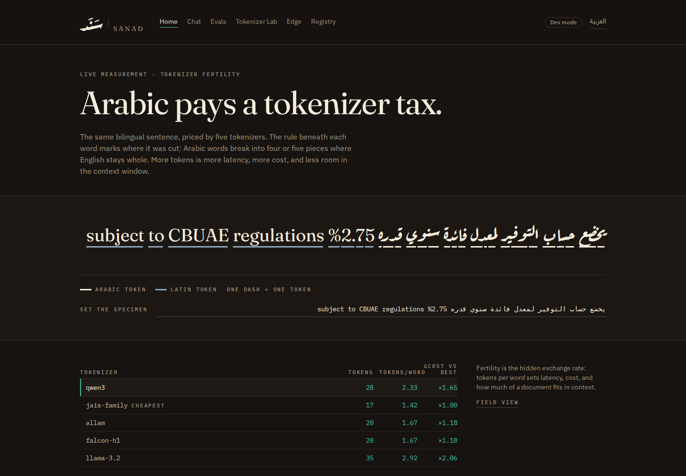
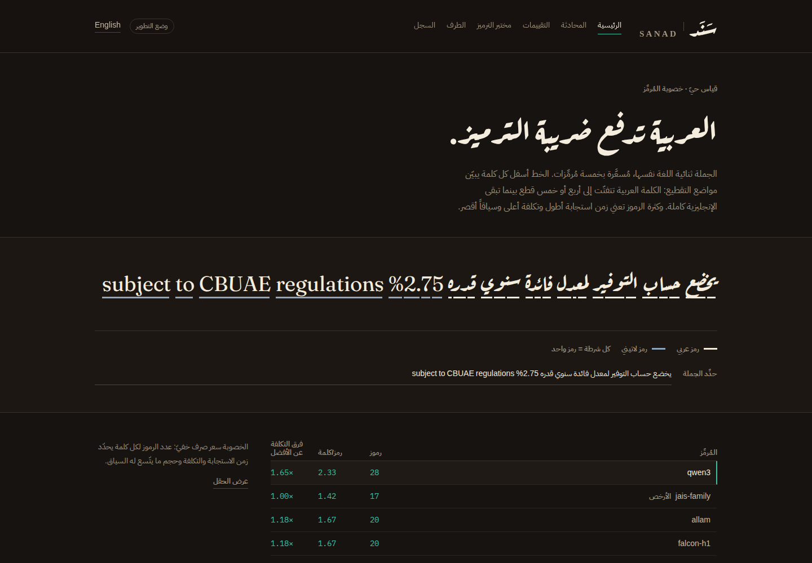
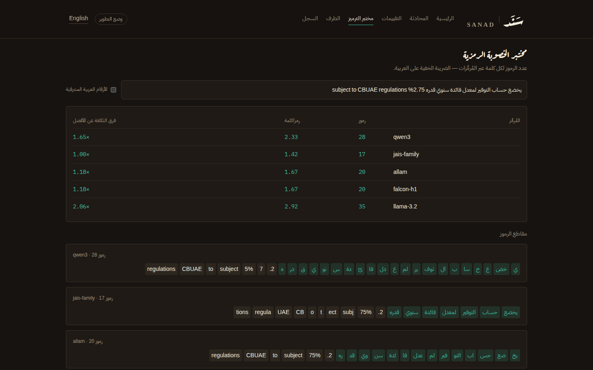
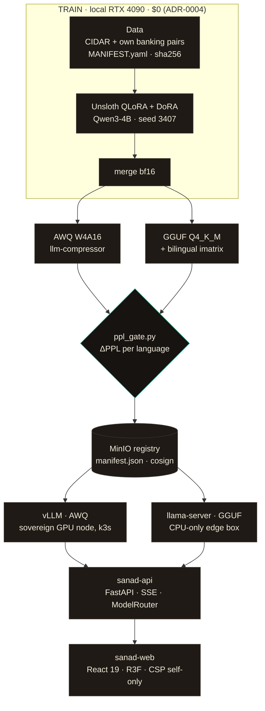

<div align="center">

# سَنَد &nbsp;·&nbsp; SANAD

### Sovereign bilingual SLM platform for Gulf banking

*A small language model, fine-tuned for under $50, running fully air-gapped —*
*from a 24 GB GPU to a CPU-only edge box, in Arabic and English.*

[](./LICENSE)
[](./ml/data/MANIFEST.yaml)
[](#arabic-is-a-first-class-citizen)
[](./justfile)

</div>



<div align="center">

**Arabic words break into four or five tokens where English words stay whole.**
That is the tax this project measures, and the rule under the sentence is where it shows.

[Quickstart](#quickstart) · [Architecture](#architecture) · [Evaluation](#evaluation-the-credibility-core) · [Commands](#command-surface) · [Roadmap](#roadmap) · [**CLAUDE.md**](./CLAUDE.md)

**سَنَد** — بالعربية: *الدعم والإسناد؛ وفي المصارف الخليجية: أداة دين.*
منصة نموذج لغوي صغير، سيادية وثنائية اللغة، للقطاع المصرفي والامتثال في دولة الإمارات.

</div>

---

## Status

> **As of 2026-07-25 — the platform is built and gated; the model pipeline has not run.**
>
> Scaffold, FastAPI gateway, React dashboard, CI and every quality gate are green
> (`just check`, 76 tests across three stacks). No data ingested, no model trained, no eval
> report produced. Every results table below is therefore **deliberately empty** — see
> [the honest-claims policy](#results). Next milestone: **P1, data.**

## The claim

> A **~4B bilingual SLM**, fine-tuned for **< $50** on a **single 24 GB GPU**, can **match a
> 5–10× larger general model** on a narrow UAE banking/compliance domain — while running
> **fully air-gapped** on a sovereign GPU node (vLLM + AWQ) and on **commodity CPU-only
> hardware** at the edge (llama.cpp + GGUF), with a **reproducible Arabic/English evaluation
> harness** behind every number.

Not a slogan — a shipped, measured artifact. Every number quoted anywhere in this repository
traces to a report file in [`ml/evals/reports/`](./ml/evals/reports/) by hash, and judge-based
claims are invalid without a human-validation κ attached.

[`CLAUDE.md`](./CLAUDE.md) is the single source of truth — architecture, prime directives, pins,
gates, and the phased roadmap. When this README and CLAUDE.md disagree, CLAUDE.md wins.

## The signature insight: tokenizer fertility

**Fertility ≈ latency ≈ cost ≈ effective context.** An English-first tokenizer shatters Arabic
words into fragments, and every fragment is a token you pay for, wait for, and burn context on.
Sanad measures **tokens/word** for five tokenizers (Qwen3, jais, ALLaM, Falcon-H1, Llama-3.2)
over three fixed corpora, exposes it live at `POST /v1/tokenize/fertility` — and makes it visible
rather than tabular.

**The Specimen** is the homepage hero. One bilingual banking sentence is set intact, at display
size, in the dual-script pairing; beneath it runs a measured rule broken into **one dash per
token**. Switch tokenizer and the rule re-cuts under unchanged text. Arabic words fall into four
or five dashes; English words stay whole.

Token marks sit *under* the text and never inside it, because text shaping does not cross element
boundaries: a `<span>` per token severs Arabic's joins and renders `التوفير` as isolated
letterforms — a typographic lie about the input. The sentence stays a single text node and
boundaries come from `Range.getClientRects()`, which the browser returns already bidi-reordered.
Details in [ADR-0005](./docs/adr/0005-specimen-hero-rubrication-design.md).

| Homepage, Arabic (RTL) | Fertility Lab — per-tokenizer detail |
|---|---|
| [](docs/screenshots/home-ar.png) | [](docs/screenshots/tokenizer-lab.png) |

> **About these captures.** The layout, type and palette are live. The token figures come from
> the repository's [e2e fixture](./apps/web/e2e/fixtures/fertility.json), not from real
> tokenizers — the pipeline has not run, so no `tokenizer.json` files exist locally yet. The
> fixture's *ordering* matches each tokenizer's known Arabic fertility; its digits are not
> measurements and are never quoted as such.

Pages: `/` Specimen + results ledger · `/chat` bilingual streaming chat · `/evals` benchmark and
judge dashboard · `/tokenizer` Fertility Lab · `/edge` live edge telemetry · `/registry` signed
artifact lineage.

## Why this exists

Sovereign AI in the Gulf is usually pitched top-down: giant models, giant clusters, giant claims.
Sanad tests the opposite corner of the design space, end to end.

| Question | Sanad's answer |
|---|---|
| Can a small model do *real* domain work? | QLoRA+DoRA fine-tune of **Qwen3-4B** on curated banking/compliance pairs, judged against 7B Arabic-native and 70B-class generalist comparators — *in-domain only, honestly scoped* |
| Can "sovereign" be more than marketing? | `SANAD_MODE=sovereign` is a **build mode**: zero egress, offline HF flags, self-hosted fonts, local-only judges, default-deny NetworkPolicies, and a Prometheus **egress-zero alert whose firing = broken promise** |
| Does Arabic get equal engineering? | RTL-first UI (logical CSS only, CI-enforced), grapheme-safe streaming so ligatures never tear, bilingual eval rubrics, **bilingual quantization calibration** — because English-only calibration silently wrecks Arabic |
| Is any of it reproducible? | Pinned lockfiles, pinned lm-eval commit, fixed seeds, sha256'd dataset manifest, cosign-signed model artifacts with full lineage: base → data hash → config hash → eval hash |

## Architecture



One contract everywhere: the **OpenAI Chat Completions dialect**. The gateway's `ModelRouter`
swaps base URLs between vLLM (GPU) and llama.cpp (edge); everything upstream — CLI tools, the
dashboard, eval jobs — speaks the same API and receives an extra `x_sanad` block (TTFT, tok/s,
detected language, sovereign flag) on every response.

Training runs on the owner's local RTX 4090 at $0
([ADR-0003](./docs/adr/0003-zero-cost-portfolio-track.md),
[ADR-0004](./docs/adr/0004-drop-jetson-single-workstation.md)). The `gpu_train` OpenTofu module
stays in-repo as a CI-validated, **plan-only** artifact and is never applied.

## Three runtime modes

One env var rules them all — `SANAD_MODE` — and everything (pydantic settings, compose profiles,
Helm values, the web build) derives from it.

| Mode | Where | Network | Inference | Judges |
|---|---|---|---|---|
| `dev` | laptop / cloud GPU | online allowed | vLLM or llama.cpp local | local + optional API judge (calibration only, flagged `sovereign=false`, **excluded from headline numbers**) |
| `sovereign` | k3s on-prem | **zero egress** | vLLM (AWQ W4A16) | local only: Falcon-H1-7B + ALLaM-7B |
| `edge` | CPU-only x86 box | zero egress | llama.cpp (GGUF Q4_K_M) | n/a — telemetry only |

## Quickstart

**Prerequisites:** [`just`](https://just.systems) ≥ 1.36 · [`uv`](https://docs.astral.sh/uv/) ≥ 0.7 ·
Node 22+ with `pnpm` ≥ 10 · Docker (for the dev stack).

```bash
git clone https://github.com/imthi16/sanad-slm.git && cd sanad-slm

just setup     # uv sync (ml + api) · pnpm install · pre-commit install
just dev       # postgres + redis + minio + mlflow + prometheus + grafana
               #   + api (uvicorn --reload :8000) + web (vite :5173)
just check     # the full PR gate: lint + types + tests (all three stacks)
               #   + data-gate + verify-no-cdn          <- currently green
```

Then open **http://localhost:5173** and flip the language toggle — the whole app goes RTL, and
the headline changes typeface with it.

<details>
<summary><b>Air-gapped demo (one box, Wi-Fi off)</b></summary>

```bash
# prepare online: side-load images + mirror models (see ops/runbooks/sovereign-demo.md)
docker compose -f infra/compose/docker-compose.yml \
               -f infra/compose/compose.sovereign.yml \
               --profile gpu up -d
```

The overlay sets `SANAD_MODE=sovereign`, exports all offline HF flags, and places every service
on an `internal: true` Docker network — outbound routing is impossible at the network layer, not
just discouraged. The runbook's checklist verifies it.
</details>

<details>
<summary><b>GPU / edge profiles for local work</b></summary>

```bash
just gpu        # adds vLLM serving the AWQ checkpoint (needs an NVIDIA GPU)
just edge-sim   # adds an x86 llama.cpp for laptop demos of the edge path
```
</details>

## Command surface

`just --list` is the only entry point you need.

<details>
<summary><b>The full recipe surface</b></summary>

| Area | Recipe | What it does |
|---|---|---|
| setup | `just setup` | sync both uv workspaces, pnpm install, pre-commit hooks |
| | `just api-types` | FastAPI OpenAPI → generated TS client (never hand-edited) |
| data | `just data` | ingest → normalize (NFC) → langid → MinHash dedup → validate → `MANIFEST.yaml` |
| | `just data-gate` | **CI license gate**: fails if any record's license ∉ {Apache-2.0, CC-BY-4.0, MIT} in a commercial manifest |
| train | `just train [cfg]` | Unsloth QLoRA+DoRA SFT (refuses unpinned HF revisions) |
| | `just merge` | adapter → merged bf16 + lineage manifest |
| quantize | `just quant-awq` | llm-compressor AWQ W4A16 (refuses < 40% Arabic calibration) |
| | `just quant-gguf` | convert → **bilingual imatrix** → Q4_K_M |
| | `just ppl-gate <model>` | ΔPPL ≤ 3% (AWQ) / 5% (GGUF), per language, + ArabicMMLU drift ≤ 1 pt |
| eval | `just eval <model>` | pinned lm-evaluation-harness across the comparator matrix |
| | `just judge <run>` | 3C3H multi-judge + Krippendorff α / Cohen κ agreement stats |
| | `just fertility` | regenerate `fertility.json` for the API and the Specimen |
| release | `just registry-push <v>` | artifacts → MinIO, cosign-signed (release gates enforced) |
| app | `just dev` / `just gpu` / `just edge-sim` | compose stacks |
| | `just check` | **everything a PR must pass locally** |
| | `just verify-no-cdn` | sovereign gate: no fetchable external origins in `web/dist` |
| infra | `just tofu-plan/apply <env>` | OpenTofu plan/apply (dev, prod) |
| | `just helm-deploy <env>` | SOPS-decrypted values → all charts |
| | `just bench-edge` | measured CPU tok/s (+ RAPL watts) → `edge_bench.json` |

</details>

## The ML pipeline

```
CIDAR (10k, Apache-2.0)  ─┐
own banking pairs         ├─▶ NFC normalize ─▶ langid (mixed if both scripts >15%)
(800–1,500, CC-BY-4.0)   ─┘        │
                                   ▼
                     MinHash dedup (Jaccard ≥ 0.85 drop)
                                   │
                                   ▼
                 schema validation ─▶ MANIFEST.yaml (counts, licenses,
                                      provenance split, sha256 — a CI gate)
                                   │
                                   ▼
              Unsloth QLoRA + DoRA on Qwen3-4B-Instruct (non-thinking mode)
              seed 3407 · NF4 · r16/α16 · <16 GB peak VRAM · $0 · MLflow-logged
                                   │
                     ┌─────────────┴─────────────┐
                     ▼                           ▼
        AWQ W4A16 (llm-compressor)     GGUF Q4_K_M + importance matrix
        calib: ≥40% Arabic, enforced   imatrix on bilingual text, enforced
                     └─────────────┬─────────────┘
                                   ▼
                  ppl_gate.py — ΔPPL per language, not pooled
                  (the classic silent failure: English-calibrated
                   quantization quietly wrecking Arabic)
```

Records carry `provenance: native | translated | synthetic`, and that split is printed into
**every** eval report. Machine-translated eval sets presented as native are how Arabic NLP
numbers lie; Sanad's rigor signal is making the split unhideable.

## Evaluation: the credibility core

**Benchmarks** — pinned lm-evaluation-harness commit, identical command for every model in the
matrix (base Qwen3-4B, fine-tuned, ALLaM-7B, jais-6.7b, Falcon-H1-3B/7B): ArabicMMLU, AraTrust,
MadinahQA, ALRAGE. Vendor numbers are quoted only *next to* our re-measured ones.

**Domain eval** — `sanad_bank_eval_v1`: 300 own-authored held-out items (150 AR / 120 EN /
30 code-switch) across extraction, classification and grounded QA. sha256-frozen, never enters
training, treated as private (BALSAM-style contamination hygiene).

**3C3H multi-judge** — Correctness is a **binary gate** (fail → score 0); then Completeness,
Conciseness, Helpfulness, Honesty, Harmlessness, each 1–5, rubrics in both languages. Judge-pool
rule: **never a judge from the tested model's family** (self-preference bias) — Qwen under test
⇒ Falcon-H1-7B + ALLaM-7B judge, locally via vLLM.

**Disagreement is data** — Krippendorff's α overall and per dimension, pairwise Cohen's κ, a
judge×dimension disagreement heatmap on the dashboard, and any item with judge spread ≥ 2 routed
to a human queue.

**Humans anchor it** — a 50-item stratified sample scored blind by a native Arabic speaker.
**No judge-based claim ships without the human↔judge κ.** The regression gate enforces it, and
the API stores non-sovereign (dev-calibration) judge scores flagged and excluded.

**Efficiency panel** — TTFT, tok/s, peak VRAM/RSS, watts (RAPL on the CPU edge, DCGM on GPU), and
$/1M output tokens from a published cost model
([`ml/evals/reports/cost_model.md`](./ml/evals/reports/cost_model.md)) — never a bare number.

## Arabic is a first-class citizen

Not a translation pass at the end — a design constraint from the first commit.

- **RTL everywhere.** `dir` flips at `<html>`; components use logical CSS properties only
  (`ms-*`, `pe-*`, `text-start`) — a pre-commit hook and CI grep **fail the build** on
  `ml-|mr-|pl-|pr-|text-left|text-right`.
- **Streaming that never tears ligatures.** SSE deltas buffer and flush on grapheme boundaries
  (`Intl.Segmenter`), holding back the last grapheme while it can still grow (lam-alef, shadda
  chains). Unit-tested with real Arabic.
- **Shaping is never sacrificed to markup.** The Specimen marks token boundaries *below* the text
  precisely so Arabic's joins survive; splitting a word across elements would break them.
- **Dual-script typography as identity.** Fraunces (Latin display) paired with Aref Ruqaa (Arabic
  display) — two calligraphic faces from unrelated traditions — over IBM Plex Sans and Plex Sans
  Arabic, one superfamily across both scripts. All self-hosted and subsetted, zero CDN.
  `font-size-adjust` matches x-heights rather than font-sizes, so Arabic never renders as the
  smaller of the two scripts.
- **Numerals done right.** `Intl.NumberFormat` per locale with a toggle for Eastern Arabic
  numerals — the UAE's `arab` system (٠١٢٣), *not* the Persian/Urdu `arabext` set (a distinction
  our own test suite caught).
- **Every i18n key exists in both catalogs** — `en/*.json` without its `ar/*.json` sibling fails
  CI; machine-drafted Arabic is flagged `pending-native` until reviewed.
- **Playwright snapshots run RTL *and* LTR for all six pages.** Bidi regressions are the #1 bug
  class in bilingual UIs; here they are a red build.

## Sovereignty, verified

Enforced at four independent layers — belt, braces, and two more belts.

1. **Process** — `SANAD_MODE=sovereign` exports `HF_HUB_OFFLINE=1`, `TRANSFORMERS_OFFLINE=1`,
   `HF_DATASETS_OFFLINE=1`; services **fail loudly** if a model dir is missing rather than
   silently fetching from a hub.
2. **Build** — `just verify-no-cdn` scans the built web bundle: zero external origins in
   fetchable HTML/CSS contexts, and a justified allowlist for inert JS strings. It has already
   caught a real leak — a 3D text library's CDN font fallback, now pinned to self-hosted fonts.
3. **Runtime** — nginx ships CSP `default-src 'self'`; the sovereign compose network is
   `internal: true`; K8s gets default-deny egress NetworkPolicies via the `sovereign-guard` chart.
4. **Observability** — the `SanadSovereignEgress` PrometheusRule: sustained non-cluster egress
   from the sovereign namespace fires a **critical alert**, required green for 24 h before any
   demo. *This alert firing = broken promise.*

Plus supply-chain hygiene: Trivy-scanned images (0 high/critical), Syft SBOMs, cosign-signed
images *and* model manifests, SOPS+age for every secret, and PII-scrubbing structlog processors
(emails, UAE IBAN, Emirates ID, phone — Arabic and Western digits) with chat content **not
persisted** by default.

## Results

> **Honest-claims policy** (prime directive 5). This table populates only from hashed report files
> in `ml/evals/reports/`. The pipeline is built and gated; the runs land at P2–P4. **No number
> appears here before its report exists** — which is why every cell below is an em-dash rather
> than a plausible placeholder.

| Metric | Base Qwen3-4B | Sanad (fine-tuned) | ALLaM-7B | jais-6.7b | Falcon-H1-7B\* | Lands at |
|---|---|---|---|---|---|---|
| Domain eval (300 items) | — | — | — | — | — | P4 |
| ArabicMMLU | — | — | — | — | — | P4 |
| 3C3H (human-anchored) | — | — | — | — | — | P4 |
| Edge tok/s @ watts (`x86-local`) | — | — | — | — | — | P3 |
| Training cost | — | — | — | — | — | P2 · < $50 gate |

\* Falcon-H1 is a benchmark comparator only (Falcon-LLM License — never in the shipping path).

The release gate is honest by construction: the fine-tuned model must beat base by **≥ +5 pts**
in-domain while staying within **−1 pt** on ArabicMMLU (no catastrophic forgetting), or the build
is red.

## Quality gates

Everything below runs in CI and locally via `just check` — **currently green end to end**.

| Layer | Tools | Gate |
|---|---|---|
| `ml/` | ruff · mypy --strict · pytest | **16 passed** — schema validators, PII scan, license gate blocks a planted non-commercial record |
| `apps/api` | ruff · mypy --strict · pytest · schemathesis | **34 passed, 92% coverage** — SSE chunk integrity, PII scrubbing (AR+EN digits), sovereign config forcing; gate is ≥ 80% |
| `apps/web` | biome · tsc --strict · vitest · Playwright | **13 unit + 13 e2e** — grapheme buffering, atlas shaping safety, numeral systems; RTL+LTR snapshots for all six pages |
| data | `just data-gate` | licenses ∈ {Apache-2.0, CC-BY-4.0, MIT} for the commercial profile |
| sovereignty | `just verify-no-cdn` | no fetchable external origins in `web/dist` |
| quantization | `ppl_gate.py` | ΔPPL ≤ 3% / 5% per language; ArabicMMLU drift ≤ 1 pt |
| eval | regression gate | domain ≥ base+5 · ArabicMMLU ≥ base−1 · judge claims require human κ |
| images | Trivy · Syft · cosign | 0 high/critical, SBOM attached, signed |
| infra | tofu validate · tflint · helm lint | plan reviewed on PR |

## Roadmap

Phases are PR milestones, each with acceptance criteria in [CLAUDE.md §13](./CLAUDE.md).

| Phase | Scope | Status |
|---|---|---|
| **P0 · Skeleton** | monorepo, justfile, CI, compose stack, RTL app shell | **done** — `just check` green, RTL+LTR snapshots green |
| **P1 · Data** | CIDAR ingest, 300 banking pairs, dedup/langid, manifest gate | **next** — tooling ready, nothing ingested |
| **P2 · Train + merge** | QLoRA on the local RTX 4090, MLflow, $0, < 16 GB VRAM | not started |
| **P3 · Quantize + serve** | AWQ + GGUF+imatrix, ppl-gate, vLLM chart, CPU edge profile | not started |
| **P4 · Eval harness** | full matrix, domain eval frozen, judges + human validation | not started |
| **P5 · Full app** | chat SSE end to end, live Specimen, all pages and scenes | partial — scenes and API built, wiring at P5 |
| **P6 · Sovereign hardening** | egress-zero 24 h, cosign verify path, checklist green | not started |
| **P7 · Position + publish** | README numbers, model card, workshop paper draft | not started |

<details>
<summary><b>Monorepo map</b></summary>

```
sanad/
├── CLAUDE.md               the specification — read first
├── justfile                the only command entry point
├── ml/                     uv workspace #1 — CUDA-heavy
│   ├── configs/            train / quant / eval YAML (a change = a new file, never mutate)
│   ├── data/               record schema · MANIFEST license gate · curation + PII scan
│   │   └── quarantine/     non-commercial research sets — CI blocks them from releases
│   ├── train/              Unsloth QLoRA+DoRA sft.py · merge.py · qwen3 chat template
│   ├── quantize/           AWQ (llm-compressor) · GGUF+imatrix · ppl_gate.py
│   ├── evals/              lm-eval runner · 300-item domain set · 3C3H judges ·
│   │                       agreement.py (α, κ, heatmap) · fertility/measure.py
│   └── registry/           MinIO push/pull · cosign-signed lineage manifests
├── apps/
│   ├── api/                uv workspace #2 — FastAPI gateway (slim, async end to end)
│   │   └── src/sanad_api/  SSE chat proxy · ModelRouter · PII-scrubbed logs ·
│   │                       evals/telemetry/tokenize/registry routers · Alembic
│   └── web/                pnpm — React 19 + Vite + Tailwind v4 + R3F
│       ├── src/components/fertility/   Specimen (the hero) · TokenizerLedger
│       └── src/three/      FertilityField (opt-in field view) · PipelineOrbit · EdgeBoard
├── serving/                vLLM container (sovereign GPU) · llama.cpp CPU edge launcher
├── infra/                  OpenTofu modules (plan-only) · 5 Helm charts
│   └── helm/charts/sovereign-guard/   default-deny egress + the egress-zero alert
├── ops/                    Grafana dashboards · Prometheus alerts · runbooks
└── docs/                   ADRs · model-card template · paper outline · screenshots
```

Two **separate** uv workspaces by design: `ml/` carries the CUDA tree, `apps/api` stays slim
enough to cold-start in seconds. Their dependency graphs never merge.
</details>

## Contributing

The working agreements ([CLAUDE.md §14](./CLAUDE.md)), abridged:

1. Read the prime directives before any task; propose compliant alternatives when a request
   conflicts with them.
2. One phase per PR · conventional commits (`feat(api): …`) · architectural changes update
   CLAUDE.md **and** add an ADR in [`docs/adr/`](./docs/adr/).
3. No new dependency without a one-line justification; never bypass lockfiles.
4. Every `en` string ships with its `ar` sibling (CI-enforced); real MSA, with machine-drafted
   strings flagged for native review.
5. Generated artifacts (TS client, `fertility.json`, reports) are never hand-edited.
6. Every number in README or paper traces to a hashed report file.
7. `just check` green before "done"; UI work attaches LTR **and** RTL screenshots.

## Acknowledgements

Sanad stands on excellent open work: [Qwen3](https://huggingface.co/Qwen) (Apache-2.0 base
model) · [CIDAR](https://huggingface.co/datasets/arbml/CIDAR) by ARBML (native Arabic
instructions) · [ALLaM](https://huggingface.co/ALLaM-AI) and
[jais](https://huggingface.co/inceptionai) (Arabic-native comparators and judges) ·
[Falcon-H1](https://huggingface.co/tiiuae) by TII (SOTA reference) ·
[lm-evaluation-harness](https://github.com/EleutherAI/lm-evaluation-harness) by EleutherAI ·
[Unsloth](https://github.com/unslothai/unsloth), [TRL](https://github.com/huggingface/trl),
[vLLM](https://github.com/vllm-project/vllm) and
[llama.cpp](https://github.com/ggml-org/llama.cpp). Typefaces: Fraunces, Aref Ruqaa and IBM Plex,
all under the SIL Open Font License.

## License

Code: **Apache-2.0** ([LICENSE](./LICENSE)) · Own datasets and docs: **CC-BY-4.0**.
Model and data licensing guardrails are CI-enforced — see
[`ml/data/MANIFEST.yaml`](./ml/data/MANIFEST.yaml) and CLAUDE.md prime directive 2.

---

<div align="center">

**سَنَد** — *because sovereignty is a build mode, not a slogan.*

</div>
